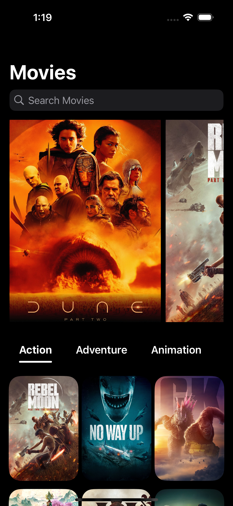
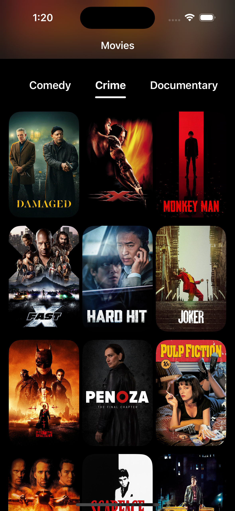
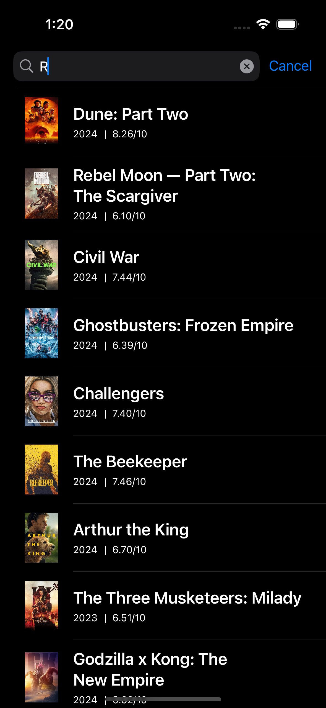
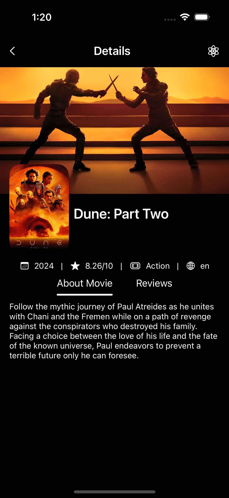
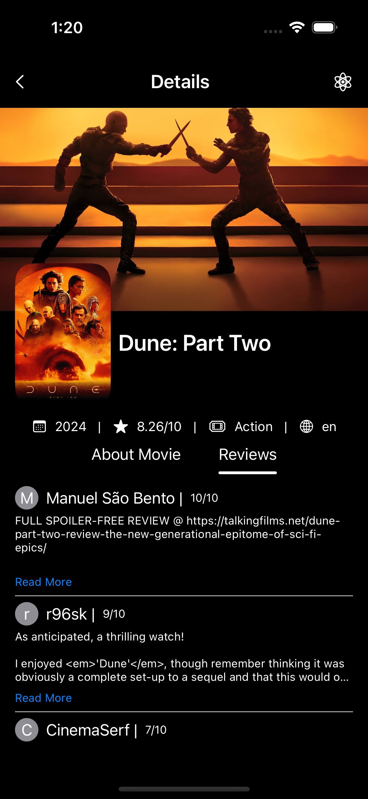
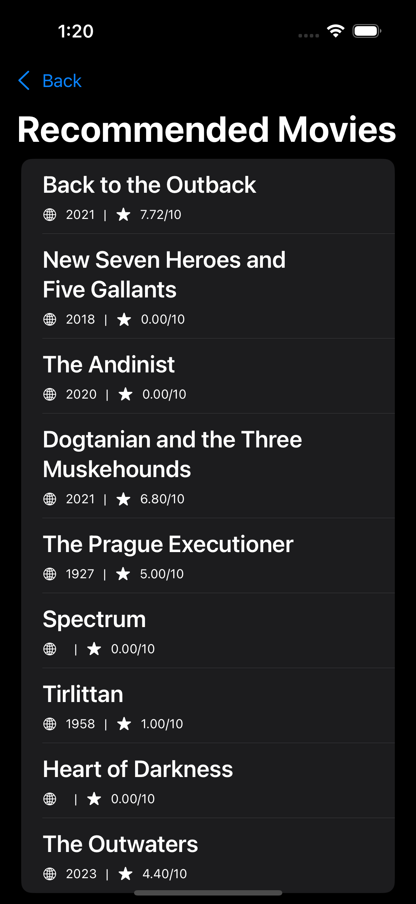

# Flick Reflector iOS SwiftUI

Flick Reflector is a sleek iOS app built with SwiftUI, following the MVVM architecture and adhering to industry-standard practices for data fetching, JSON decoding, and UI rendering. It provides users with a seamless experience to explore and discover movies, leveraging modern SwiftUI features and elegant design principles.

## Features

- **SwiftUI**: Utilizes Apple's latest UI framework for building fluid and responsive user interfaces.
- **MVVM Architecture**: Follows the Model-View-ViewModel architectural pattern for a clean separation of concerns and maintainability.
- **API Integration**: Fetches movie data from external APIs using API_KEY, ensuring seamless integration and up-to-date information.
- **JSON Decoding**: Implements robust JSON decoding mechanisms to efficiently parse API responses and populate models.
- **Asynchronous Image Loading**: Displays movie posters and backdrops asynchronously for smooth scrolling and enhanced user experience.
- **Data Segregation**: Organizes data fetching and presentation logic to ensure only necessary information is retrieved and displayed.
- **SwiftUI Components**: Utilizes a variety of SwiftUI components including ListView, ScrollView, LazyVStack, LazyVGrid, VStack, and HStack for flexible and dynamic layouts.
- **Custom UI Elements**: Implements custom movie cards such as CustomMovieCard for visually appealing and informative movie representations.
- **Search Functionality**: Implements a search feature allowing users to easily find movies by querying the API with search terms and dynamically updating the UI with relevant results.
- **OpenAI Integration**: Recommends movies using the OpenAI API powered by "gpt-3.5-turbo", extracting key information such as movie name, year, and rating to provide personalized recommendations.

## Usage

To use Flick Reflector, follow these steps:

1. Clone the repository to your local machine.
2. Obtain an API_KEY from the designated movie database API provider.
3. Replace the placeholder API_KEY in the codebase with your own API key.
4. Build and run the app on your iOS device or simulator.

## Screenshots

 &nbsp;&nbsp;&nbsp;&nbsp; 

 &nbsp;&nbsp;&nbsp;&nbsp; 

 &nbsp;&nbsp;&nbsp;&nbsp; 

## License

This project is licensed under the MIT License - see the [LICENSE](LICENSE) file for details.

## Acknowledgments

- Special thanks to the creators of SwiftUI and OpenAI for their innovative technologies.
- Inspiration drawn from various SwiftUI and MVVM resources and communities.

## Contributing

Contributions are welcome! If you find any bugs or have suggestions for improvement, please open an issue or submit a pull request.

## Contact

For any inquiries or feedback, feel free to contact the project maintainer at [your-email@example.com](mailto:ameykanunje@gmail.com).
